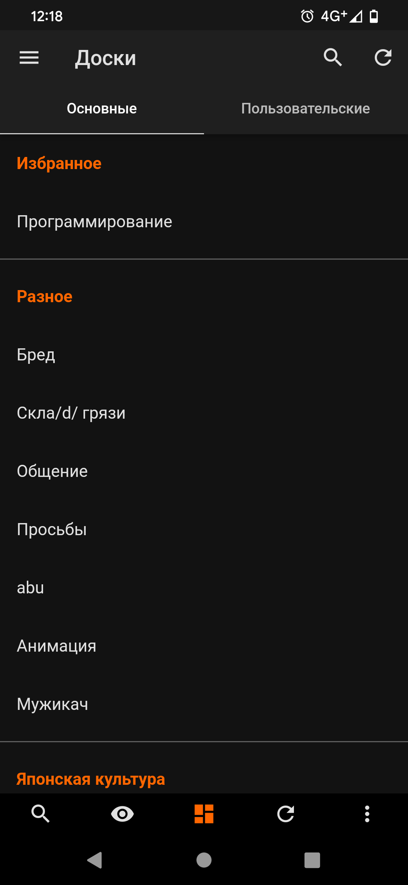
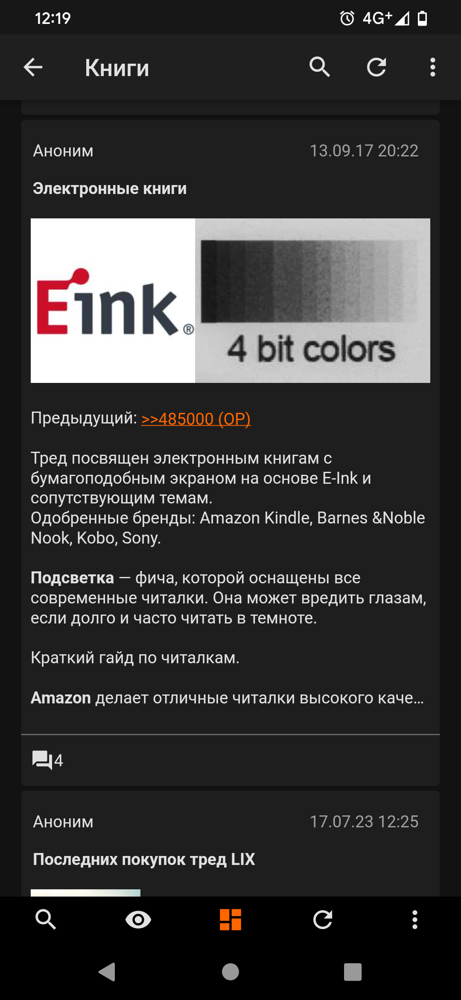
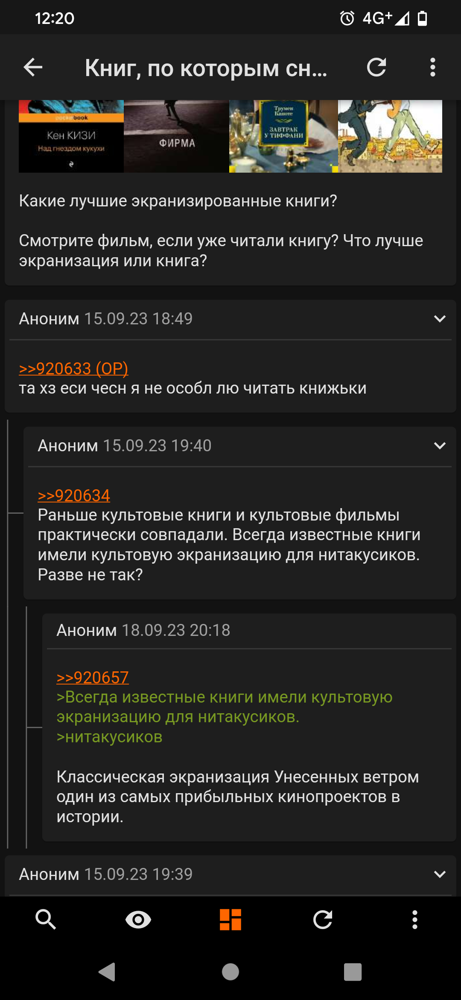
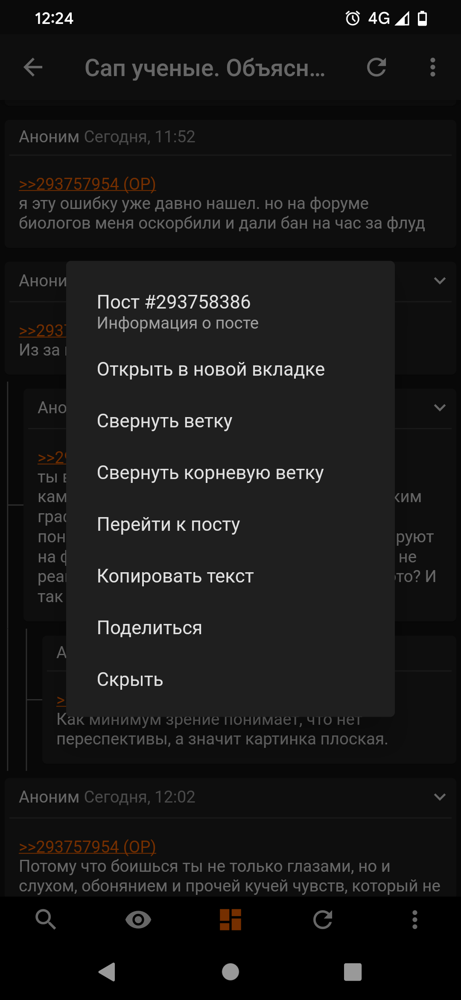
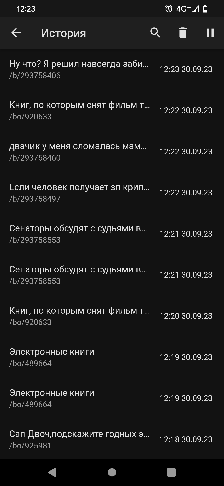
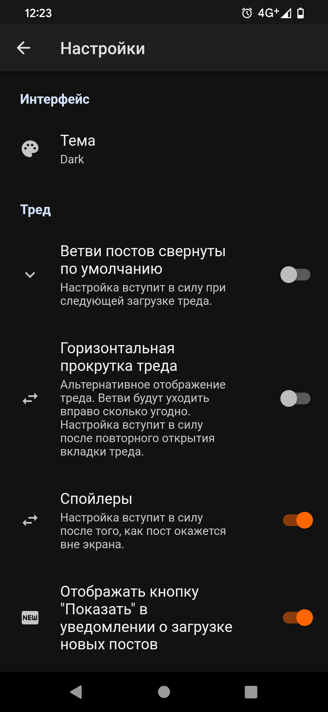
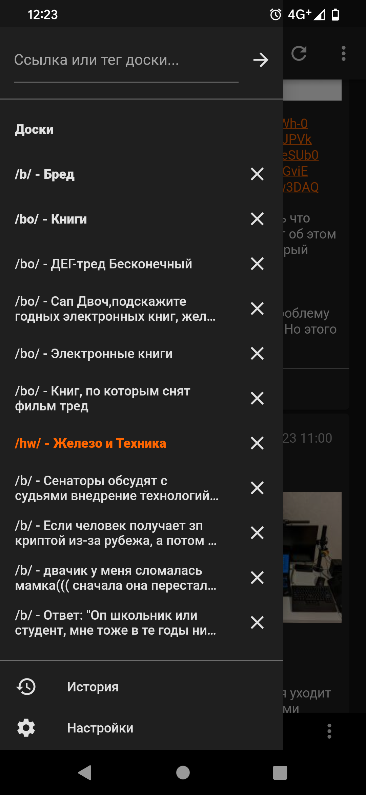
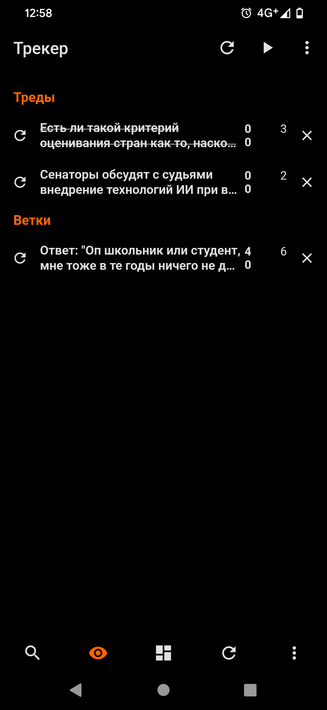

# Treechan
### Имиджборд-клиент с древовидным отображением постов.

  
   
   
   

  
  
   
   
 

На текущем этапе можно пользоваться приложением в read-only. Возможность отвечать в треды и создавать их будет добавлена к релизу.

 ### Ключевые возможности:
 - Организация постов в треде в виде иерархии, наглядно изобращающей, кто кому ответил, без необходимости создания диалоговых окон
 - Сворачивание веток постов, возможность отображать все ветки свернутыми или развернутыми изначально, навигация по иерархии постов посредством автоскролла/предпросмотра в диалоговом окне
 - Открытие веток в отдельных вкладках и отслеживание новых постов в этой вкладке через трекер
 - Просмотр последних постов в шторке справа и переход к ним через контекстное меню
 - Галерея предпросмотра медиа, реализованная как карусель, но отображающая сразу столько медиа, сколько помещается в ширину экрана
 - Поисковская строка в боковой панели: можно вставить ссылку или тег доски (опционально id треда) и перейти туда
 - Альтернативный вид отображения треда: включение горизонтальной прокрутки для удобства чтения длинных веток
 - Скрытие тредов и постов свайпом
 - История посещений и поиск по ней

 ### Прочие возможности:
 - Доступно 4 темы приложения: Makaba Clasic, Makaba Night, Dark и Amoled. На скриншотах тема Dark (кроме последнего - Amoled)
 - Базовый функционал имиджборд-клиента: просмотр списка досок, каталога доски, тредов, обновление тредов, поиск по доскам и по каталогу, сортировка тредов по бампам/времени, скачивание изображений, возможность поделиться тредом/постом
 - Трекер обновлений в тредах/ветках, push-уведомления о новых постах (по умолчанию отключены), настройка интервала автообновления
 - Добавление досок в избранное, изменение их порядка в избранном
 - Поиск по списку досок и по каталогу доски.
